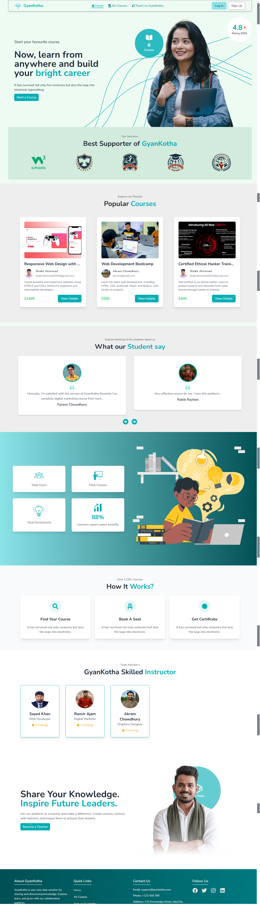
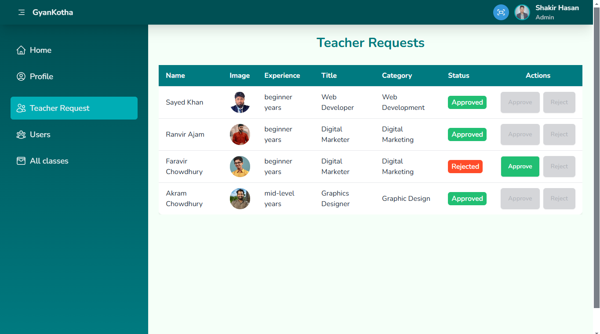

# 📚 GyanKotha

A comprehensive e-learning platform designed to revolutionize online education by bridging the gap between students and educators with seamless interaction and engaging features.

## 🌟 Live Demo

Check out the live version of the application [here](https://gyankotha-by-shakir.netlify.app).

---

## 📚 Purpose

GyanKotha is built to empower learners and educators by providing a centralized platform for:

- Accessing high-quality online courses.
- Connecting students with educators.
- Enhancing the overall learning experience with interactive features.

---

## ✨ Key Features

1. **User Authentication**:

   - Secure login and registration functionality.
   - User role-based access (student/teacher).
   - Password recovery option via email.

2. **Course Management**:

   - Add, edit, and manage courses with detailed descriptions, pricing, and content.
   - Dynamic course filtering and categorization for easy access.

3. **Assignment Tracking**:

   - Students can view and submit assignments directly from their dashboard.
   - Teachers can create and manage assignments, set deadlines, and track submissions.

4. **Class Progress Tracking**:

   - Teachers can monitor total enrollments, assignments created, and submissions received.
   - Students can view their enrolled courses and track assignment completion.

5. **Reviews and Feedback**:

   - Students can provide feedback for courses and their learning experience in under 50 words.
   - Teachers can view and respond to reviews.

6. **Interactive UI**:

   - Designed with a modern and responsive interface for mobile and desktop users.
   - Easy navigation and engaging visuals.

---

## 🛠️ Technologies Used

### Frontend

- **React.js**: Component-based UI framework.
- **React Router**: For seamless navigation.
- **Tailwind CSS**: For modern and responsive UI.
- **React Hot Toast**: For notifications and alerts.
- **Material Tailwind**: Enhanced UI components for a polished look.

### Backend

- **Node.js**: Server-side runtime environment.
- **Express.js**: Web application framework.
- **MongoDB**: Database for managing data.

### Additional Tools

- **React Icons**: For modern icons and visuals.
- **Helmet**: Dynamic page titles for better SEO optimization.
- **Axios**: For efficient API communication.
- **Tanstack**: For better API communication .

---

## 📦 npm Packages Used

```bash
npm install react react-dom react-router-dom
npm install tailwindcss @material-tailwind/react react-hot-toast
npm install axios react-icons react-helmet
npm install daisyui
```

---

## 📸 Screenshots

### Landing Page View



### Dashboard View



---

## 🌐 Contribution

We welcome contributions to improve GyanKotha. Feel free to:

- Report bugs.
- Suggest features.
- Submit pull requests.

---

## 📩 Contact

For queries, feel free to reach out:

- Email: shakirahmmad2002@gmail.com
- Website: [GyanKotha](https://gyankotha.netlify.app)
- GitHub: [Shakir Hasan](https://github.com/shakirhasan133/)

---

## 🖖 License

This project is licensed under the MIT License. See the [LICENSE](LICENSE) file for details.
